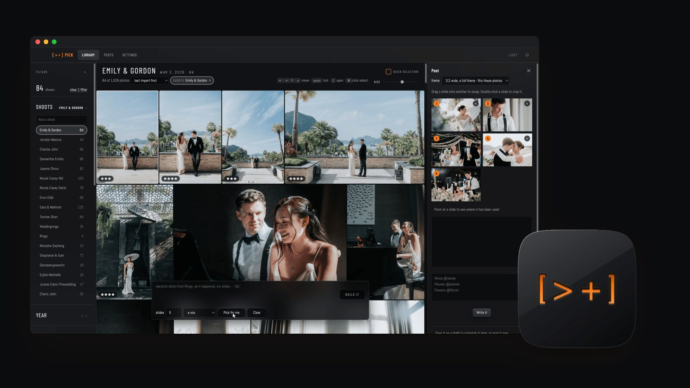
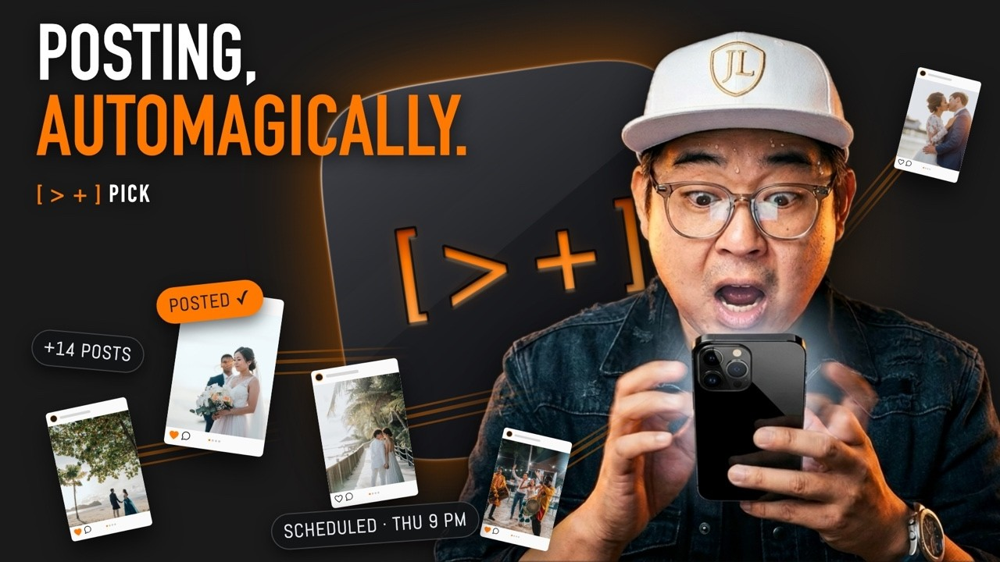
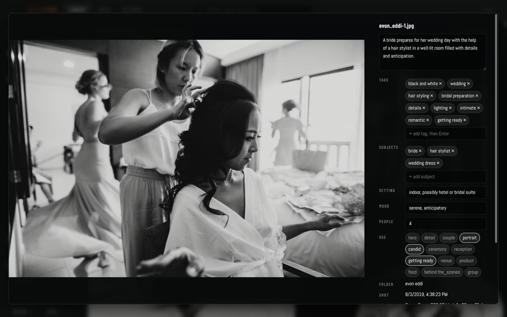
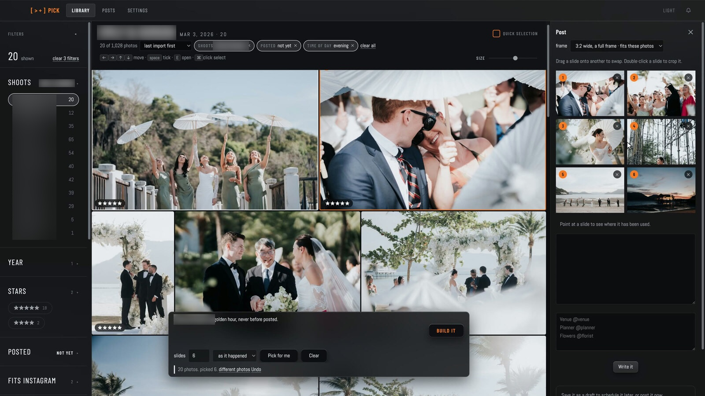
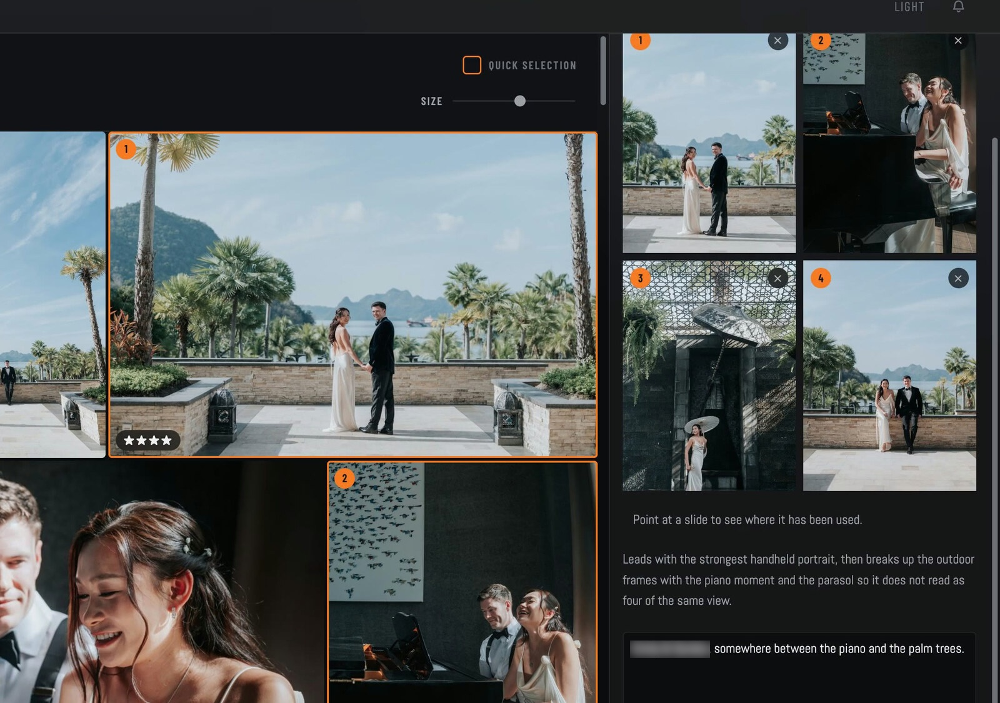
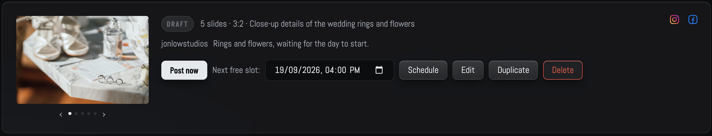
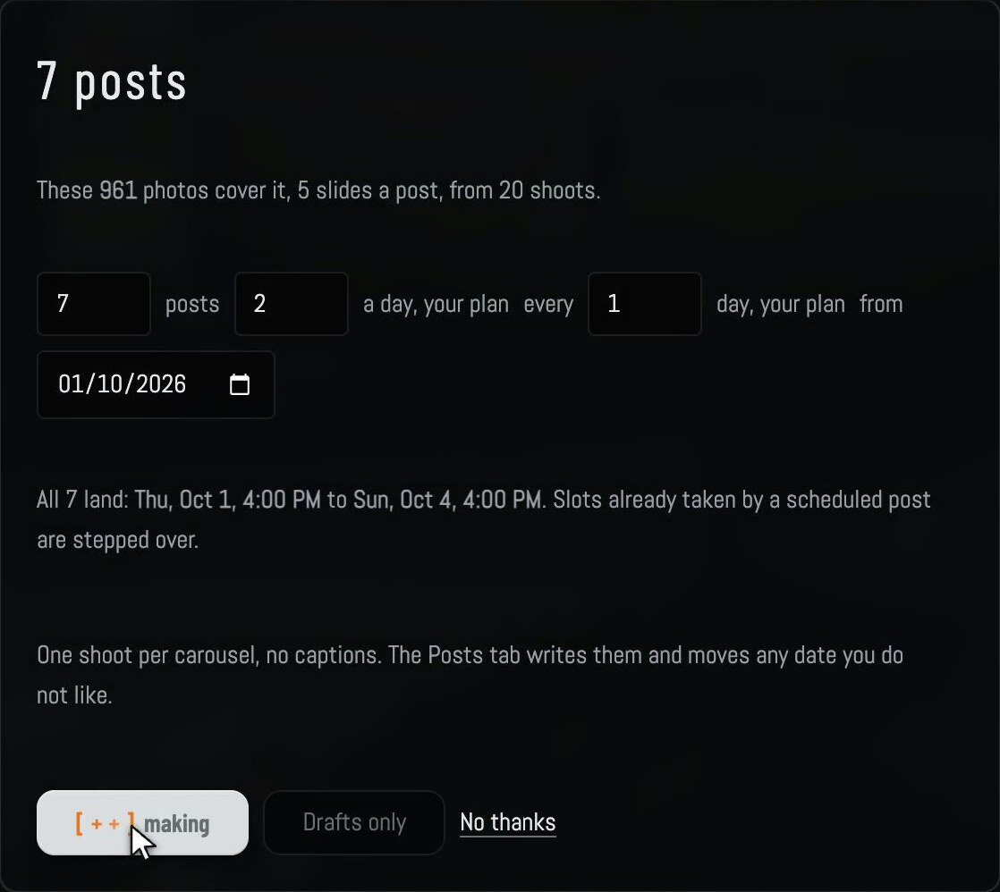

# OMS Pick

**Post your photos to Instagram and Facebook from your Mac. Free.**

Your best photos are sitting on a drive. OMS Pick finds the ones you meant to post, and posts them. Your library of photos stays on your Mac, no uploads to anybody's website, no subscription, no account in the middle.

I am Jon Low, a wedding photographer in Kuala Lumpur. I have an issue to stay active on Instagram and Facebook, so I created this app to feature the photographs that I captured.

### [⬇ Download for Mac](https://github.com/yitweng/oms-pick/releases/latest)

136 MB · Apple silicon · signed and notarised, so it opens without a warning

[See it in full](https://www.onemoreshot.net/pick/) · [What changed](CHANGELOG.md) · [Ask a question](https://github.com/yitweng/oms-pick/discussions)

### Watch the film

Ten minutes on what it does and why I built it.

---

## 1. It reads your library

A vision model runs on your own Mac and writes down what it sees in each photo: a caption, tags, who is in it, the setting, the mood. About 17 seconds a photo on an M1, so it runs at 2am while you sleep.

## 2. You type a sentence

"Jane & John Doe at golden hour, never before posted." The grid narrows as you type. Press Build it and it lays the photos out in the order of the day.

## 3. It lays out the carousel

It leads with the strongest frame and breaks up similar shots, so a carousel does not read as four of the same view. Drag a slide onto another to swap. Double-click to crop.

## 4. It writes the caption, in your voice

Optional, and it uses your own Claude or DeepSeek key. It reads your last 100 captions and sounds like them. It sends words. Never pictures.

## 5. It posts

Straight to Instagram and Facebook. Every step shows as it happens. Or drop it on a calendar and it goes out on time from the menu bar.

## A week of posts from one sentence

"Make me 7 days of posts from different events, 5 photos each, from 1 October." Seven carousels, seven dates, ready for you to check. Nothing goes out until you press Schedule.

---

## Nothing leaves your Mac

Your photographs are never uploaded to me or to anyone else. The index runs locally. Your original files are never moved or changed.

Two honest footnotes, because a privacy claim with an asterisk hidden at the bottom is worth nothing:

- **When you post, your slides sit on a public address for about 60 seconds** while Instagram fetches them. That is how Meta's API works: it pulls from a URL, you cannot push a file. The app opens a temporary tunnel for that minute and closes it.
- **If you use the caption writer**, the words go to Anthropic or DeepSeek on your own API key. Never the pictures.

## Every AI feature can be switched off

No key, no account, no model if you do not want one. Point it at a folder, click the photos you want, type your own caption, post. It still works.

## What you need

| | |
|---|---|
| **Mac** | Apple silicon. M1 or newer. |
| **Reading photos** | [Ollama](https://ollama.com), free, running on your Mac. The first run points you to it and pulls the model. |
| **Posting** | An Instagram business or creator account, a Facebook Page, or both. |
| **Captions** | Your own Claude or DeepSeek key. Optional. |
| **Setup** | About twenty minutes, once. Written out step by step, with pictures. |
| **Price** | Free. No subscription, no fee per post. If it earns you one, buy me a coffee. |

## Install

1. Download the `.dmg` from [Releases](https://github.com/yitweng/oms-pick/releases/latest).
2. Drag it to Applications and open it.
3. The first run checks for Ollama, pulls the vision model, and asks for one folder to start with.

After that it updates itself.

## Why you set up your own Meta app

Meta will not let one app post to another person's Instagram account without their App Review, which is pending. Until it clears, each photographer makes their own Meta app. It takes about twenty minutes, once, and the guide walks every click.

It has a side benefit worth keeping either way: posts carry **your own studio name**, not mine.

## Source

This repository carries the releases. The app is not open source today. It is a solo project I still make my living around, and I would rather ship it than manage a fork queue. Ask me anything about how it works and I will answer.

## Hear about the next one

The app updates itself, so you never need me for that. But if you want to know when there is a new version, or whatever I make next, leave an address at [onemoreshot.net/pick](https://www.onemoreshot.net/pick/). One line now and then, and never sold.

## Questions

Open a [Discussion](https://github.com/yitweng/oms-pick/discussions). I read all of them.

---

Made by [Jon Low](https://www.jonlow.com) · [One More Shot](https://www.onemoreshot.net)
